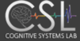

<!-- Improved compatibility of back to top link: See: https://github.com/othneildrew/Best-README-Template/pull/73 -->
<a name="readme-top"></a>
<!--
*** Thanks for checking out the Best-README-Template. If you have a suggestion
*** that would make this better, please fork the repo and create a pull request
*** or simply open an issue with the tag "enhancement".
*** Don't forget to give the project a star!
*** Thanks again! Now go create something AMAZING! :D
-->


<!-- PROJECT SHIELDS -->
<!--
*** I'm using markdown "reference style" links for readability.
*** Reference links are enclosed in brackets [ ] instead of parentheses ( ).
*** See the bottom of this document for the declaration of the reference variables
*** for contributors-url, forks-url, etc. This is an optional, concise syntax you may use.
*** https://www.markdownguide.org/basic-syntax/#reference-style-links
-->
[![Contributors][contributors-shield]][contributors-url]
[![Issues][issues-shield]][issues-url]
[![MIT License][license-shield]][license-url]

<!-- PROJECT LOGO -->
<br />
<div align="center">
  <a href="https://github.com/othneildrew/Best-README-Template">
    
  </a>

  <h1 align="center">ARL FREEDOM Project Task 2.2.1</h1>

</div>


<!-- Cognitive Radar: Mobility -->
# Cognitive Radar: Mobility

<p align="center">
	
</p>

The first thrust of the FREEDOM project task 2.2.1 focused on optimizing the position of mobile radars to enhance radar range measurements of multiple targets, taking into account dynamic and mission constraints. 

Our approach improves upon previous approaches by:
* Using a distance-dependent range measurement model, where measurement noise increases with distance, unlike previous methods with constant covariance noise.
* Optimizing the Model Predictive Control objective using Model Predictive Path Integrals, which are computationally efficient and can handle non-smooth, nonconvex objectives, unlike previous methods that use deterministic solvers like CasADi.
* Highlighting the pitfalls of the constant covariance measurement noise and stationary radars.

<p align="right">(<a href="#readme-top">back to top</a>)</p>


### Built With
[![Jax][jax.com]][jax-url]


<p align="right">(<a href="#readme-top">back to top</a>)</p>


<!-- GETTING STARTED -->
## Getting Started


### Prerequisites
1. Download and install [Anaconda](https://www.anaconda.com/) for python package management.
2. Create a virtual environment with python version 3.9
   ```sh
   conda create -n FREEDOM python=3.9
   ```
3. Activate the conda **FREEDOM** virtual environment
   ```sh
   conda activate FREEDOM
   ```
4. Clone the Github repo
   ```sh
   git clone https://github.com/neu-spiral/FREEDOM221
   ```
### Installation

1. Install python packages
   ```sh
   pip install -r requirements.txt
   ```
<p align="right">(<a href="#readme-top">back to top</a>)</p>

<!-- USAGE EXAMPLES -->
## Usage

To run a basic example of 3 radars tracking 4 targets over 1000 time steps, with the radars maintaining a distance of 125 meters from the targets.
<p align="right">(<a href="#readme-top">back to top</a>)</p>

```bash
# change to the folders related to mobile radars
cd OptimalTrackingAndControl\src_faster

python main_expectation.py --N_radar=3 \
                         --fim_method=SFIM \
                         --alpha2=1000 \
                         --alpha3=500 \
                         --seed=123 \
                         --experiment_name=test \
                         --N_steps=1000 \
                         --R2T=125
```
<p align="right">(<a href="#readme-top">back to top</a>)</p>

More details on experiment parameters may be found by running  `python main_expectation.py -h`

```commandline
python main_expectation.py -h

optional arguments:
  -h, --help            show this help message and exit
  --seed SEED           Random seed to kickstart all randomness (default: 123)
  --frame_skip FRAME_SKIP
                        Save the images at every nth frame (must be a multiple of the update on the control frequency, which is dt control / dt ckf) (default: 4)
  --dt_ckf DT_CKF       Frequency at which the radar receives measurements and updated Cubature Kalman Filter (default: 0.025)
  --dt_control DT_CONTROL
                        Frequency at which the control optimization problem occurs with MPPI (default: 0.1)
  --N_radar N_RADAR     The number of radars in the experiment (default: 6)
  --N_steps N_STEPS     The number of steps in the experiment. Total real time duration of experiment is N_steps x dt_ckf (default: 600)
  --results_savepath RESULTS_SAVEPATH
                        Folder to save bigger results folder (default: results)
  --experiment_name EXPERIMENT_NAME
                        Name of folder to save temporary images to make GIFs (default: experiment)
  --move_radars, --no-move_radars
                        Do you wish to allow the radars to move? --move_radars for yes --no-move_radars for no (default: True)
  --remove_tmp_images, --no-remove_tmp_images
                        Do you wish to remove tmp images? --remove_tmp_images for yes --no-remove_tmp_images for no (default: True)
  --tail_length TAIL_LENGTH
                        The length of the tail of the radar trajectories in plottings (default: 10)
  --save_images, --no-save_images
                        Do you wish to saves images/gifs? --save_images for yes --no-save_images for no (default: True)
  --fim_method FIM_METHOD
                        FIM Calculation [SFIM,PFIM,SFIM_bad,PFIM_bad] (default: SFIM)
  --fc FC               Radar Signal Carrier Frequency (Hz) (default: 100000000.0)
  --Gt GT               Radar Transmit Gain (default: 200)
  --Gr GR               Radar Receive Gain (default: 200)
  --rcs RCS             Radar Cross Section in m^2 (default: 1)
  --L L                 Radar Loss (default: 1)
  --R R                 Radius for specific SNR (desired) (default: 500)
  --Pt PT               Radar Power Transmitted (W) (default: 1000)
  --SNR SNR             Signal-Noise Ratio for Experiment. Radar has SNR at range R (default: -20)
  --acc_std ACC_STD     MPPI init heading acc std (default: 25)
  --ang_acc_std ANG_ACC_STD
                        MPPI init angular acc std (default: 0.7853981633974483)
  --horizon HORIZON     MPC Horizon (default: 15)
  --acc_init ACC_INIT   Initial Heading Acceleration (default: 0)
  --ang_acc_init ANG_ACC_INIT
                        Initial Angular Acceleration (default: 0.0)
  --num_traj NUM_TRAJ   Number of MPPI control sequences samples to generate (default: 250)
  --MPPI_iterations MPPI_ITERATIONS
                        Number of MPPI sub iterations (proposal adaptations) (default: 25)
  --temperature TEMPERATURE
                        Temperature on the objective function. Lower temperature accentuates the differences between scores in MPPI (default: 0.1)
  --elite_threshold ELITE_THRESHOLD
                        Elite Threshold (between 0-1, where closer to 1 means reject most samaples) (default: 0.9)
  --AIS_method AIS_METHOD
                        Type of importance sampling. [CE,information] (default: CE)
  --gamma GAMMA         Discount Factor for MPC objective (default: 0.95)
  --speed_minimum SPEED_MINIMUM
                        Minimum speed Radars should move [m/s] (default: 5)
  --R2T R2T             Radius from Radar to Target to maintain [m] (default: 125)
  --R2R R2R             Radius from Radar to Radar to maintain [m] (default: 10)
  --alpha1 ALPHA1       Cost weighting for FIM (default: 1)
  --alpha2 ALPHA2       Cost weighting for maintaining distanace between Radar to Target (default: 1000)
  --alpha3 ALPHA3       Cost weighting for maintaining distance between Radar to Radar (default: 500)
  --alpha4 ALPHA4       Cost weighting for smooth controls (between 0 to 1, where closer to 1 means no smoothness (default: 1)
  --alpha5 ALPHA5       Cost weighting to maintain minimum absolute speed (default: 0)
```

<!-- CONTACT -->
# Contact

Michael Potter - [linkedin](https://www.linkedin.com/in/michael-lynn-potter/) - potter.mi@northeastern.edu <br />
Paul Ghanem - <br />
Shuo Tang -  <br />
<p align="right">(<a href="#readme-top">back to top</a>)</p>


<!-- ACKNOWLEDGMENTS -->
# Acknowledgments
> Research was sponsored by the Army Research Laboratory and was accomplished under Cooperative Agreement Number W911NF-23-2-0014. The views and conclusions contained in this document are those of the authors and should not be interpreted as representing the official policies, either expressed or implied, of the Army Research Laboratory or the U.S. Government. The U.S. Government is authorized to reproduce and distribute reprints for Government purposes notwithstanding any copyright notation herein.

# Citing This Paper
Please cite the following paper if you intend to use this code or dataset for your research.
> TBD soon

<!-- MARKDOWN LINKS & IMAGES -->
<!-- https://www.markdownguide.org/basic-syntax/#reference-style-links -->
[contributors-shield]: https://img.shields.io/github/contributors/othneildrew/Best-README-Template.svg?style=for-the-badge
[contributors-url]: https://github.com/othneildrew/Best-README-Template/graphs/contributors
[forks-shield]: https://img.shields.io/github/forks/othneildrew/Best-README-Template.svg?style=for-the-badge
[forks-url]: https://github.com/othneildrew/Best-README-Template/network/members
[stars-shield]: https://img.shields.io/github/stars/othneildrew/Best-README-Template.svg?style=for-the-badge
[stars-url]: https://github.com/othneildrew/Best-README-Template/stargazers
[issues-shield]: https://img.shields.io/github/issues/othneildrew/Best-README-Template.svg?style=for-the-badge
[issues-url]: https://github.com/neu-spiral/FREEDOM221/issues
[license-shield]: https://img.shields.io/github/license/othneildrew/Best-README-Template.svg?style=for-the-badge
[license-url]: https://github.com/othneildrew/Best-README-Template/blob/master/LICENSE.txt
[linkedin-shield]: https://img.shields.io/badge/-LinkedIn-black.svg?style=for-the-badge&logo=linkedin&colorB=555
[linkedin-url]: https://linkedin.com/in/othneildrew
[product-screenshot]: images/screenshot.png
[Next.js]: https://img.shields.io/badge/next.js-000000?style=for-the-badge&logo=nextdotjs&logoColor=white
[Next-url]: https://nextjs.org/
[React.js]: https://img.shields.io/badge/React-20232A?style=for-the-badge&logo=react&logoColor=61DAFB
[React-url]: https://reactjs.org/
[Vue.js]: https://img.shields.io/badge/Vue.js-35495E?style=for-the-badge&logo=vuedotjs&logoColor=4FC08D
[Vue-url]: https://vuejs.org/
[Angular.io]: https://img.shields.io/badge/Angular-DD0031?style=for-the-badge&logo=angular&logoColor=white
[Angular-url]: https://angular.io/
[Svelte.dev]: https://img.shields.io/badge/Svelte-4A4A55?style=for-the-badge&logo=svelte&logoColor=FF3E00
[Svelte-url]: https://svelte.dev/
[Laravel.com]: https://img.shields.io/badge/Laravel-FF2D20?style=for-the-badge&logo=laravel&logoColor=white
[Laravel-url]: https://laravel.com
[Bootstrap.com]: https://img.shields.io/badge/Bootstrap-563D7C?style=for-the-badge&logo=bootstrap&logoColor=white
[Bootstrap-url]: https://getbootstrap.com
[JQuery.com]: https://img.shields.io/badge/jQuery-0769AD?style=for-the-badge&logo=jquery&logoColor=white
[JQuery-url]: https://jquery.com 
[jax-url]: https://github.com/google/jax
[jax.com]: https://img.shields.io/badge/JAX-Accelerated-9cf.svg?style=flat-square&logo=data:image/png;base64,iVBORw0KGgoAAAANSUhEUgAAAC0AAAAaCAYAAAAjZdWPAAAIx0lEQVR42rWWBVQbWxOAkefur%2B7u3les7u7F3ZIQ3N2tbng8aXFC0uAuKf2hmlJ3AapIgobMv7t0w%2Ba50JzzJdlhlvNldubeq%2FY%2BXrTS1z%2B6sttrKfQOOY4ns13ecFImb47pVvIkukNe4y3Junr1kSZ%2Bb3Na248tx7rKiHlPo6Ryse%2F11NKQuk%2FV3tfL52yHtXm8TGYS1wk4J093wrPQPngRJH9HH1x2fAjMhcIeIaXKQCmd2Gn7IqSvG83BueT0CMkTyESUqm3vRRggTdOBIb1HFDaNl8Gdg91AFGkO7QXe8gJInpoDjEXC9gbhtWH3rjZ%2F9yK6t42Y9zyiC1iLhZA8JQe4eqKXklrJF0MqfPv2bc2wzPZjpnEyMEVlEZCKQzYCJhE8QEtIL1RaXEVFEGmEaTn96VuLDzWflLFbgvqUec3BPVBmeBnNwUiakq1I31UcPaTSR8%2B1LnditsscaB2A48K6D9SoZDD2O6bELvA0JGhl4zIYZzcWtD%2BMfdvdHNsDOHciXwBPN18lj7sy79qQCTNK3nxBZXakqbZFO2jHskA7zBs%2BJhmDmr0RhoadIZjYxKIVHpCZngPMZUKoQKrfEoz1PfZZdKAe2CvP4XnYE8k2LLMdMumwrLaNlomyVqK0UdwN%2BD7AAz73dYBpPg6gPiCN8TXFHCI2s7AWYesJgTabD%2FS5uXDTuwVaAvvghncTdk1DYGkL0daAs%2BsLiutLrn0%2BRMNXpunC7mgkCpshfbw4OhrUvMkYo%2F0c4XtHS1waY4mlG6To8oG1TKjs78xV5fAkSgqcZSL0GoszfxEAW0fUludRNWlIhGsljzVjctr8rJOkCpskKaDYIlgkVoCmF0kp%2FbW%2FU%2F%2B8QNdXPztbAc4kFxIEmNGwKuI9y5gnBMH%2BakiZxlfGaLP48kyj4qPFkeIPh0Q6lt861zZF%2BgBpDcAxT3gEOjGxMDLQRSn9XaDzPWdOstkEN7uez6jmgLOYilR7NkFwLh%2B4G0SQMnMwRp8jaCrwEs8eEmFW2VsNd07HQdP4TgWxNTYcFcKHPhRYFOWLfJJBE5FefTQsWiKRaOw6FBr6ob1RP3EoqdbHsWFDwAYvaVI28DaK8AHs51tU%2BA3Z8CUXvZ1jnSR7SRS2SnwKw4O8B1rCjwrjgt1gSrjXnWhBxjD0Hidm4vfj3e3riUP5PcUCYlZxsYFDK41XnLlUANwVeeILFde%2BGKLhk3zgyZNeQjcSHPMEKSyPPQKfIcKfIqCf8yN95MGZZ1bj98WJ%2BOorQzxsPqcYdX9orw8420jBQNfJVVmTOStEUqFz5dq%2F2tHUY3LbjMh0qYxCwCGxRep8%2FK4ZnldzuUkjJLPDhkzrUFBoHYBjk3odtNMYoJVGx9BG2JTNVehksmRaGUwMbYQITk3Xw9gOxbNoGaA8RWjwuQdsXdGvpdty7Su2%2Fqn0qbzWsXYp0nqVpet0O6zzugva1MZHUdwHk9G8aH7raHua9AIxzzjxDaw4w4cpvEQlM84kwdI0hkpsPpcOtUeaVM8hQT2Qtb4ckUbaYw4fXzGAqSVEd8CGpqamj%2F9Q2pPX7miW0NlHlDE81AxLSI2wyK6xf6vfrcgEwb0PAtPaHM1%2BNXzGXAlMRcUIrMpiE6%2Bxv0cyxSrC6FmjzvkWJE3OxpY%2BzmpsANFBxK6RuIJvXe7bUHNd4zfCwvPPh9unSO%2BbIL2JY53QDqvdbsEi2%2BuwEEHPsfFRdOqjHcjTaCLmWdBewtKzHEwKZynSGgtTaSqx7dwMeBLRhR1LETDhu76vgTFfMLi8zc8F7hoRPpAYjAWCp0Jy5dzfSEfltGU6M9oVCIATnPoGKImDUJNfK0JS37QTc9yY7eDKzIX5wR4wN8RTya4jETAvZDCmFeEPwhNXoOlQt5JnRzqhxLZBpY%2BT5mZD3M4MfLnDW6U%2Fy6jkaDXtysDm8vjxY%2FXYnLebkelXaQtSSge2IhBj9kjMLF41duDUNRiDLHEzfaigsoxRzWG6B0kZ2%2BoRA3dD2lRa44ZrM%2FBW5ANziVApGLaKCYucXOCEdhoew5Y%2Btu65VwJqxUC1j4lav6UwpIJfnRswQUIMawPSr2LGp6WwLDYJ2TwoMNbf6Tdni%2FEuNvAdEvuUZAwFERLVXg7pg9xt1djZgqV7DmuHFGQI9Sje2A9dR%2FFDd0osztIRYnln1hdW1dff%2B1gtNLN1u0ViZy9BBlu%2BzBNUK%2BrIaP9Nla2TG%2BETHwq2kXzmS4XxXmSVan9KMYUprrbgFJqCndyIw9fgdh8dMvzIiW0sngbxoGlniN6LffruTEIGE9khBw5T2FDmWlTYqrnEPa7aF%2FYYcPYiUE48Ul5jhP82tj%2FiESyJilCeLdQRpod6No3xJNNHeZBpOBsiAzm5rg2dBZYSyH9Hob0EOFqqh3vWOuHbFR5eXcORp4OzwTUA4rUzVfJ4q%2FIa1GzCrzjOMxQr5uqLAWUOwgaHOphrgF0r2epYh%2FytdjBmUAurfM6CxruT3Ee%2BDv2%2FHAwK4RUIPskqK%2Fw4%2FR1F1bWfHjbNiXcYl6RwGJcMOMdXZaEVxCutSN1SGLMx3JfzCdlU8THZFFC%2BJJuB2964wSGdmq3I2FEcpWYVfHm4jmXd%2BRn7agFn9oFaWGYhBmJs5v5a0LZUjc3Sr4Ep%2FmFYlX8OdLlFYidM%2B731v7Ly4lfu85l3SSMTAcd5Bg2Sl%2FIHBm3RuacVx%2BrHpFcWjxztavOcOBcTnUhwekkGlsfWEt2%2FkHflB7WqKomGvs9F62l7a%2BRKQQQtRBD9VIlZiLEfRBRfQEmDb32cFQcSjznUP3um%2FkcbV%2BjmNEvqhOQuonjoQh7QF%2BbK811rduN5G6ICLD%2BnmPbi0ur2hrDLKhQYiwRdQrvKjcp%2F%2BL%2BnTz%2Fa4FgvmakvluPMMxbL15Dq5MTYAhOxXM%2FmvEpsoWmtfP9RxnkAIAr%2F5pVxqPxH93msKodRSXIct2l0OU0%2FL4eY506L%2B3GyJ6UMEZfjjCDbysNcWWmFweJP0Jz%2FA0g2gk80pGkYAAAAAElFTkSuQmCC
